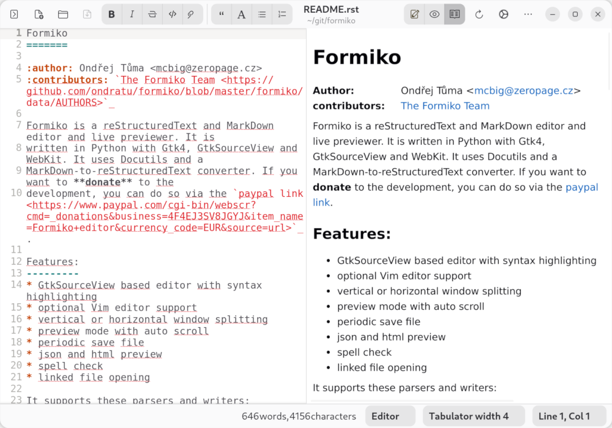
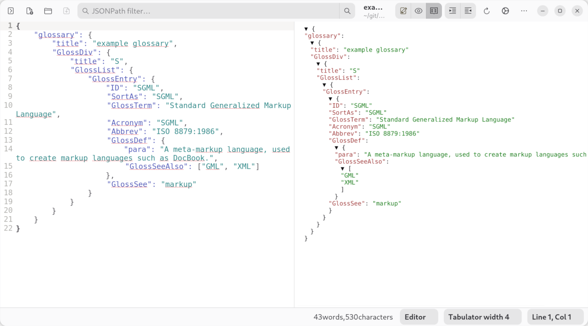

.. Formiko — GitHub Pages landing page
.. Build: rst2html5 --stylesheet=_static/style.css --link-stylesheet --no-doc-title index.rst index.html

Formiko
=======

A reStructuredText & Markdown editor with live preview —
for writers, developers and documentation authors.

- `Install via Flatpak <https://flathub.org/apps/cz.zeropage.Formiko>`__
- `View on GitHub <https://github.com/ondratu/formiko>`__
- `Other platforms <#installation>`__

   Formiko — editor and live HTML preview, side by side.

Features
========

Everything you need to write great documentation.

Syntax Highlighting 🎨
----------------------

GtkSourceView-powered editor with full RST and Markdown syntax
highlighting and theme support.

Live Preview ⚡
---------------

See your rendered HTML output instantly as you type — no manual
refresh needed.

Flexible Split View ⬛⬜
-------------------------

Arrange editor and preview side by side — horizontally or vertically —
to match your workflow.

RST & Markdown 📝
-----------------

First-class support for reStructuredText (Docutils) and Markdown
via the M2R2 converter.

JSON & HTML Preview 🔍
----------------------

Browse and search JSON files with JSONPath queries, or preview
generated HTML directly in the preview pane.

Spell Check ✅
--------------

Integrated spell checking powered by libspelling — supports multiple
languages via Hunspell.

Vim / Neovim Support ⌨️
-----------------------

Run Formiko as ``formiko-vim`` to edit with a full embedded Neovim
instance.

Auto-save 💾
------------

Periodic background saves protect your work — even when you forget
to hit Ctrl+S.

JSON Preview
============

   Browse complex JSON structures and query them with JSONPath
   expressions in real time.

Parsers & Writers
=================

Formiko is built on the Docutils ecosystem. Choose the output format
that fits your project.

RST Parser
----------

Full Docutils reStructuredText parser — the gold standard for
Python documentation.

Markdown via M2R2
-----------------

Convert CommonMark Markdown to RST on the fly before rendering.

HTML 5 Writer
-------------

Clean, standards-compliant HTML5 output via the Docutils
html5_polyglot writer.

HTML 4 Writer
-------------

Legacy HTML4/CSS1 output for maximum compatibility.

PEP HTML Writer
---------------

Python Enhancement Proposal styled output, faithful to
python.org formatting.

S5 Slide Show
-------------

Generate browser-based S5 slide presentations directly from RST.

Tiny HTML Writer
----------------

Minimal single-file HTML output with optional
``docutils-tinyhtmlwriter``.

JSON Viewer
-----------

Native JSON browsing with JSONPath-ng search — no writer needed.

Installation
============

.. image:: https://flathub.org/assets/badges/flathub-badge-en.png
   :target: https://flathub.org/apps/cz.zeropage.Formiko
   :alt: Get it on Flathub
   :height: 56

The easiest way to install Formiko is via Flatpak from Flathub —
available for any Linux distribution that supports Flatpak.

.. code-block:: sh

   flatpak install flathub cz.zeropage.Formiko
   flatpak run cz.zeropage.Formiko

Debian / Ubuntu
---------------

.. code-block:: sh

   apt install python3-pip python3-gi python3-docutils \
               python3-jsonpath-ng python3-pygments \
               gir1.2-gtksource-5 gir1.2-webkit-6.0 \
               gir1.2-spelling-1 gir1.2-adw-1

   pip3 install formiko --break-system-packages

FreeBSD
-------

.. code-block:: sh

   pkg install py311-pygobject py311-docutils py311-pygments \
       py311-pip gtksourceview5 webkit2-gtk_60 \
       libspelling py311-jsonpath-ng libadwaita

   pip-3.11 install formiko

Contribute
==========

.. class:: callout-bug

.. admonition:: 🐛 Found a bug or have a feature request?

   Open an issue on GitHub — the best way to report problems,
   suggest improvements, or start a discussion.

   `Open an Issue on GitHub → <https://github.com/ondratu/formiko/issues>`__

.. class:: callout-donate

.. admonition:: ☕ Enjoying Formiko?

   Formiko is free, open-source software maintained in spare time.
   If it saves you time or makes your work easier, consider a small
   donation — it keeps the project going.

   `Donate via PayPal → <https://www.paypal.com/cgi-bin/webscr?cmd=_donations&business=4F4EJ3SV8JGYJ&item_name=Formiko+editor&currency_code=EUR&amount=5&source=url>`__

.. footer::

   **Formiko** — BSD-3-Clause ·
   `GitHub <https://github.com/ondratu/formiko>`__ ·
   `Issues <https://github.com/ondratu/formiko/issues>`__ ·
   `Flathub <https://flathub.org/apps/cz.zeropage.Formiko>`__

   Made with ❤️ by `Ondřej Tůma <mailto:mcbig@zeropage.cz>`__ and
   `contributors <https://github.com/ondratu/formiko/blob/master/formiko/data/AUTHORS>`__.
